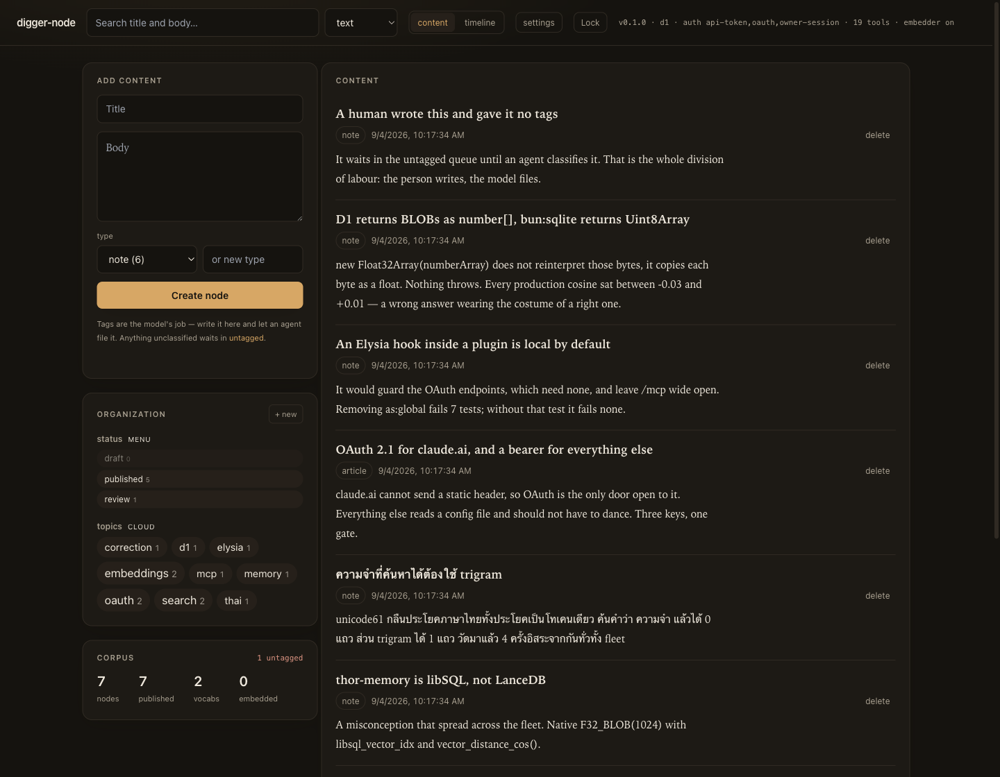
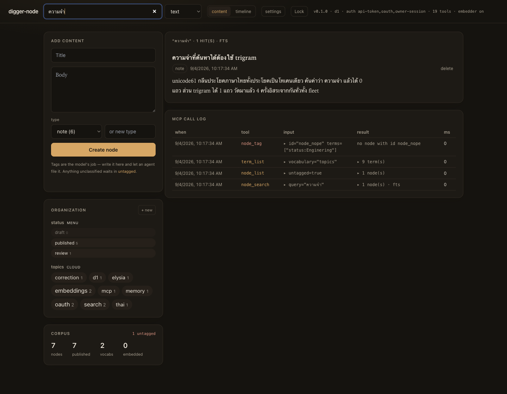
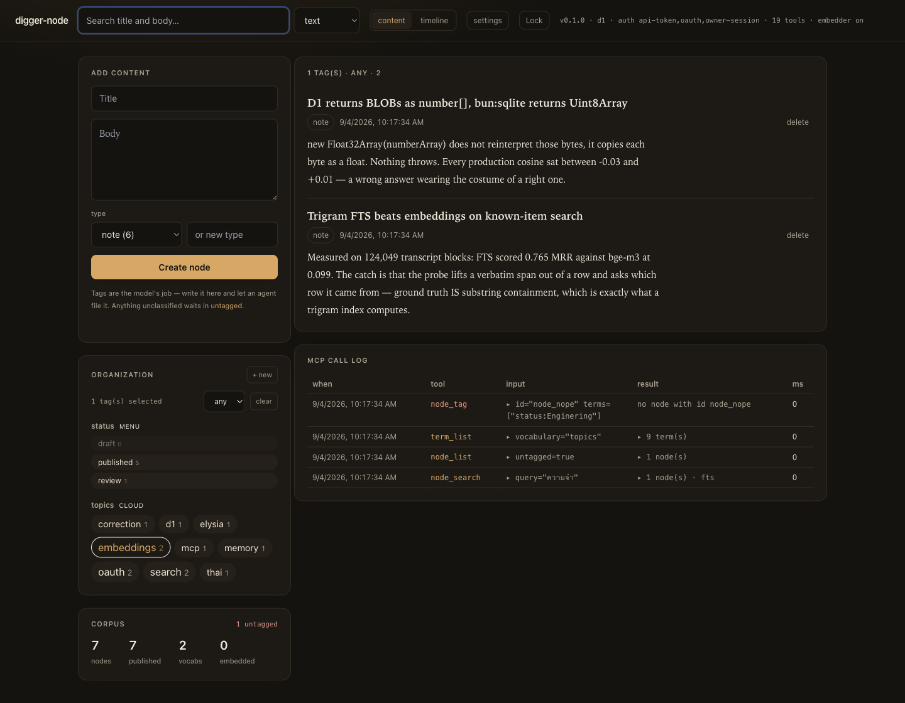
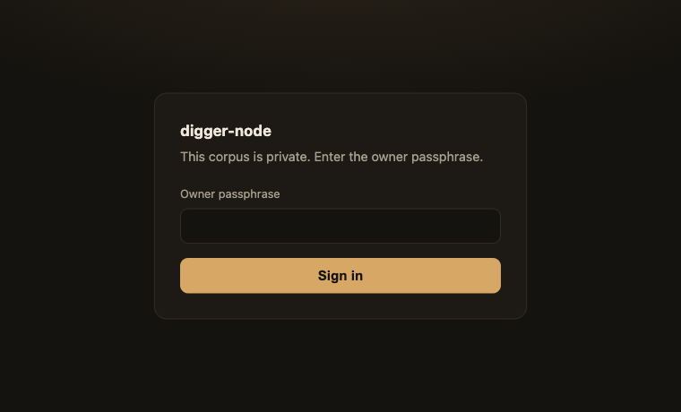
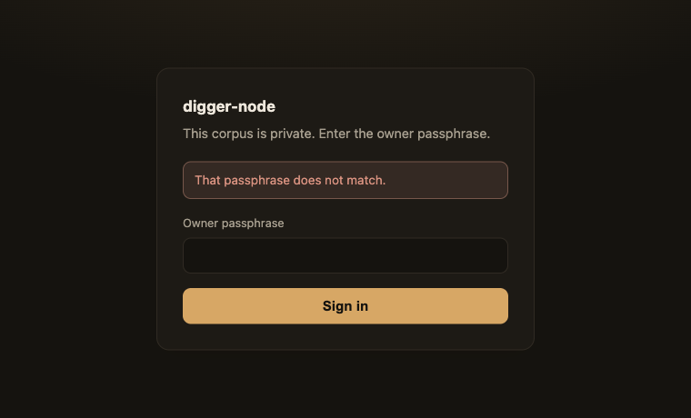
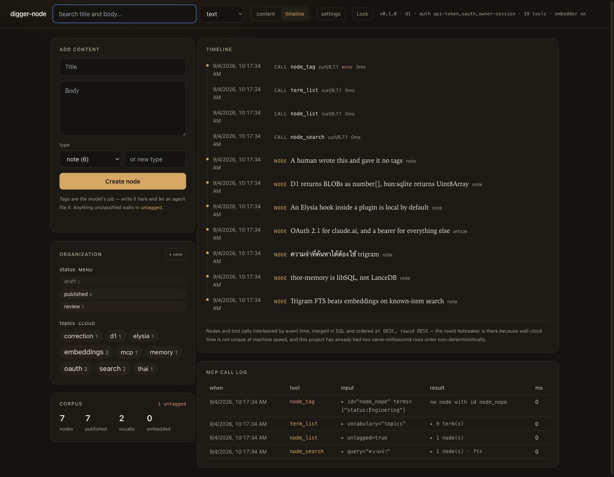
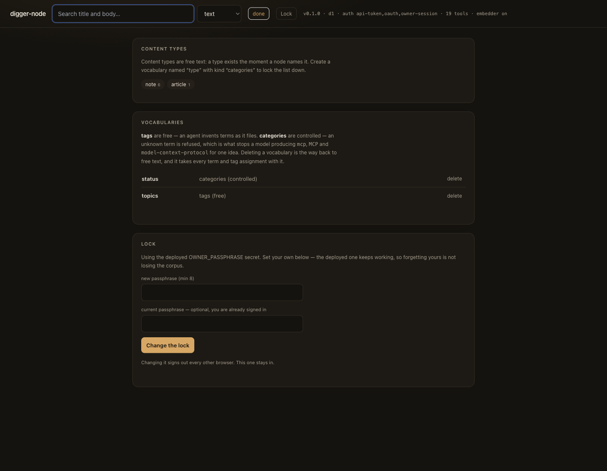
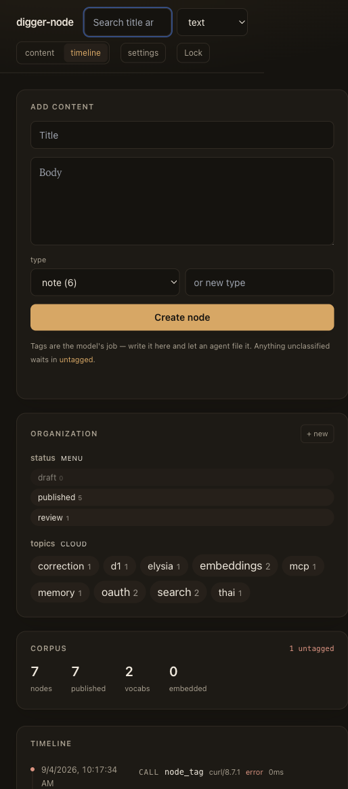

# digger-node — a visual tour

Every screenshot here is a real running instance, captured from the browser
against a live Worker with a real corpus and a real OAuth flow. Nothing is a
mockup; the error messages are the ones the server actually produces, and they
are re-shot whenever the interface changes rather than left to drift.

- **[Connecting claude.ai](connect-claude-ai.md)** — the OAuth flow, end to end.
- Source and design notes: [`../README.md`](../README.md), [`../DESIGN.md`](../DESIGN.md).

---

## The site

One page. On the left, the things a person does: write a node, define a
vocabulary, filter. On the right, the corpus and the MCP call log. The header
strip is the whole deployment stated in one line —
`v0.1.0 · d1 · auth: api-token,oauth,owner-session · 18 tools · embedder on` —
so which backend answered, which doors are open, and whether semantic search is
even possible are never things you have to infer.

Note what the create form does **not** have: a tag input.

---

## Who tags: the model, not the person

The division of labour is the point. A person writes and files nothing; the
model reads and classifies. So the person's form has no tag field, every tag in
the sidebar is a *filter* you click, and anything nobody has classified yet
collects in **untagged** — which is not a warning, it is the agent's work list.

The call log underneath shows the loop actually running, and two refusals worth
reading:

- `node_tag id="node_nope"` → **`no node with id node_nope`**. It used to say
  `D1_ERROR: FOREIGN KEY constraint failed: SQLITE_CONSTRAINT`, which describes
  the storage engine's difficulty rather than the caller's mistake and which no
  model can act on. Found by reading this very screenshot.
- `node_tag terms=["status:Enginering"]` → **`"Enginering" is not a term in the
  controlled vocabulary "status". Available: draft, published, review.`** This
  is the entire reason controlled vocabularies exist here. A model tagging the
  same idea twice produces `mcp`, `MCP` and `model-context-protocol` — three
  rows, one idea, and a taxonomy that has quietly stopped being able to answer
  "show me everything about X". Nothing errors; the corpus just rots.

---

## Search says which engine answered

`SEARCH "ความจำ" — 1 HIT(S) — MODE: FTS`.

That is a match **inside** a Thai sentence, which is the whole reason this index
is trigram rather than the default. FTS5's `unicode61` tokenizer swallows a Thai
sentence as a single token: the same query returns 0 rows under it and 1 row
under trigram. This fleet measured that independently four separate times before
anyone wrote it down.

The mode is reported on every response, and it is never guessed. Text search is
the default because on this fleet's own labelled corpus it scored **0.765 MRR
against bge-m3's 0.099** for known-item retrieval — with the honest caveat that
the probe's ground truth *is* substring containment, which is exactly what a
trigram index computes. Semantic mode exists for the other question, and hybrid
is opt-in because equal-weight fusion measured **worse** (0.44) than either.

---

## Tags filter; they are not decoration

Click a tag and the corpus narrows. The cloud sizes terms by usage on a log
scale, so a tag with 40 nodes and one with 4 are visibly different without one
of them dominating the panel. A cloud whose sizes do not encode usage is just a
list with inconsistent typography.

`Editorial status` renders as a **menu** rather than a cloud, because it is a
controlled vocabulary with weights — few, broad, ordered. That is Drupal's
distinction and it is worth keeping: the vocabulary's kind decides how it is
displayed, because the kind is already a statement about how many terms there
will be and who is allowed to add them.

---

## Auth is opt-in, and the server says which state it is in

With no secret set, the server is **open** — anyone who can reach the URL can
read and write, and `/health` reports `"auth": "none"` so it is never a guess.
That is the deliberate first-run state for a one-click deploy: a button that
produces a Worker returning 401 to its own owner, with no screen on which to set
a secret, is a broken install.

Set `OWNER_PASSPHRASE` and the page gets a lock screen:

One passphrase is the entire account system. There is no user table, and the
session cookie it mints carries no data — it is a signed expiry and nothing
else, so possession of a valid one proves only that the holder knew the
passphrase recently. Rotating the passphrase invalidates every outstanding
session for free.

---

## The corpus as a chronology

`content` and `timeline` are two views of the same corpus. The timeline
interleaves **two kinds of event** — a node was written, a tool was called —
ordered by event time.

The merge happens in SQL rather than by zipping two lists in the client, and that
is the whole reason it can be trusted: it makes `ORDER BY at DESC, rowid DESC`
possible, and the client cannot see `rowid`. Wall-clock time is not unique at
machine speed — this project has already had two same-millisecond rows order
non-deterministically, caught by a test — so the insertion counter is the
tiebreaker.

That is not a hypothetical worry. A dig across this fleet's own stores found six
different ordering keys for one kind of record and only one of them correct: some
with empty timestamps, one with duplicate sequence numbers, one with no time
field at all, and session transcripts whose records are **not** in time order
despite being an append-only file. The page states its ordering rule under the
list rather than leaving you to assume it.

## Settings

Configuration is its own route (`#/settings`), not a third segment in the
`content | timeline` toggle — those two are views of your data; this is not.

- **Content types** — what a node may be, and a field to allow another. When a
  controlled vocabulary is refusing an unknown type, the refusal in the create
  form renders the button that grants it. The error used to say
  `Add it with term_create{vocabulary:"type"}`, which is an MCP call a person
  reading a web form cannot make.
- **Vocabularies** — the kind of each, and delete. Deleting is the documented way
  back to free text, and it reports what it would cost first: terms and tag
  assignments both cascade, so "delete the vocabulary" silently means "delete
  every tag anyone ever applied from it".
- **Lock** — change the passphrase without a redeploy. It is stored in D1 as
  PBKDF2, so the read-only Cloudflare secret is no longer the only key; that
  secret keeps working as the recovery path, which is why forgetting the one you
  set is not the same as losing the corpus.

## On a phone

One column, the compose box first. The health strip is hidden below `sm` — it is
operator detail, and it was wrapping to two lines and pushing the app down.

## Screens index

| Image | What it shows |
|---|---|
| [`01-lock-screen.png`](images/01-lock-screen.png) | `/` with a passphrase set, signed out |
| [`02-lock-screen-refused.png`](images/02-lock-screen-refused.png) | The same, after a wrong passphrase |
| [`03-home.png`](images/03-home.png) | The corpus, taxonomy, tag cloud, call log |
| [`04-oauth-consent.png`](images/04-oauth-consent.png) | The OAuth approval page claude.ai lands on |
| [`05-oauth-consent-refused.png`](images/05-oauth-consent-refused.png) | Consent refused — no code issued, no redirect |
| [`06-search-thai.png`](images/06-search-thai.png) | Trigram FTS matching inside a Thai sentence |
| [`07-tag-filter.png`](images/07-tag-filter.png) | Filtering by clicking a tag |
| [`08-untagged.png`](images/08-untagged.png) | The untagged queue and the MCP call log |
| [`09-timeline.png`](images/09-timeline.png) | Nodes and tool calls interleaved by event time |
| [`10-settings.png`](images/10-settings.png) | Content types, vocabularies, and the lock |
| [`11-mobile.png`](images/11-mobile.png) | The same page at 390px |
