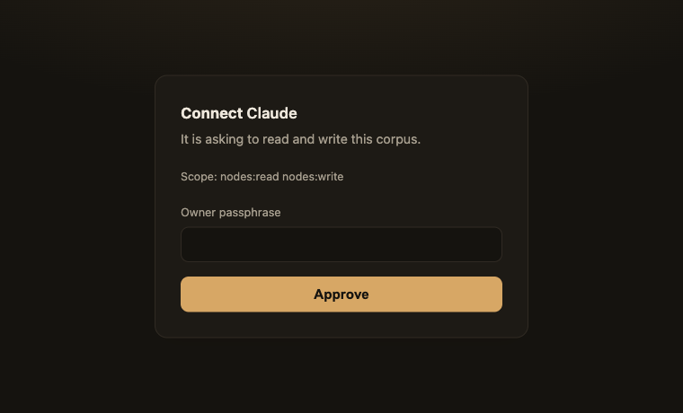
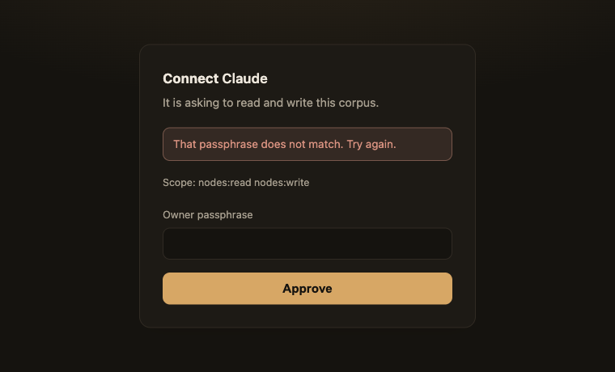

# Connecting claude.ai to trace-node

*Inherited from digger-node at the fork (`ff5b5cd`); the `digger-node` names in
the examples below are renamed in step 1 of the PRD.*

claude.ai cannot send a static header. That single fact is why this server has
an OAuth authorization server in it at all — no amount of bearer-token support
reaches the one client that motivated the feature.

Everything else (curl, Claude Code, a script, a desktop client) reads a config
file and can send a header, so it gets `API_TOKEN` and skips the dance.

---

## 1. Turn OAuth on

```bash
wrangler secret put OWNER_PASSPHRASE   # OAuth + the web login
wrangler secret put API_TOKEN          # optional: static bearer for scripts
```

Confirm the server agrees:

```console
$ curl -s https://<your-worker>.workers.dev/health | jq .auth
[ "api-token", "oauth", "owner-session" ]
```

`/health` names the doors rather than saying "on". A deployment with only
`API_TOKEN` set reports `["api-token"]` — which tells a claude.ai user, before
they spend ten minutes on it, that this connector cannot work yet.

## 2. Add the connector

**Settings → Connectors → Add custom connector**, and paste:

```
https://<your-worker>.workers.dev/mcp
```

Include the `/mcp` path. The RFC 9728 metadata document advertises
`resource: "https://<host>/mcp"`, and that value has to match the URL you typed.

## 3. Approve it

claude.ai registers itself, discovers the endpoints, and sends you here:



This is the only human step in the flow, and the owner passphrase *is* the
authorization decision — there is no account system behind it. Get it wrong and
nothing is issued:



Note what does **not** happen on a refusal: no authorization code, and no
redirect. A bad client or an unregistered `redirect_uri` also fails on this
page rather than bouncing the browser onwards — redirecting in order to say
"no" would reintroduce exactly the open redirect the exact-match check exists to
prevent.

---

## What the flow actually is

OAuth 2.1, and only the parts a remote MCP server owes:

| Piece | Why it is not optional |
|---|---|
| Dynamic Client Registration (RFC 7591) | claude.ai registers itself; there is no screen anywhere to paste a `client_id` into |
| Authorization code + PKCE **S256** | `plain` is refused at issue time, not merely unadvertised |
| AS metadata (RFC 8414) | how a client finds `/authorize` and `/oauth/token` |
| Protected resource metadata (RFC 9728) | how a client gets from a 401 on `/mcp` to the authorization server |
| `iss` on the redirect (RFC 9207) | lets a client prove which authorization server answered |

Codes live 10 minutes and are single-use. Tokens live 30 days. There are no
refresh tokens and no client secrets — a public client cannot keep a secret,
which is the whole reason PKCE exists.

Storage is three tables in the D1 database that is already bound; there is no KV
namespace to provision, so the one-click deploy still provisions exactly what it
did before. Codes and tokens are stored as **SHA-256 digests**: the token is the
secret, so a row holding one is as sensitive as the session it opens.

### The discovery chain

```console
$ curl -s https://<host>/.well-known/oauth-protected-resource/mcp
{
  "resource": "https://<host>/mcp",
  "authorization_servers": ["https://<host>"],
  "scopes_supported": ["nodes:read", "nodes:write"],
  "bearer_methods_supported": ["header"]
}

$ curl -s https://<host>/.well-known/oauth-authorization-server
{
  "issuer": "https://<host>",
  "authorization_endpoint": "https://<host>/authorize",
  "token_endpoint": "https://<host>/oauth/token",
  "registration_endpoint": "https://<host>/oauth/register",
  "code_challenge_methods_supported": ["S256"],
  "token_endpoint_auth_methods_supported": ["none"],
  "authorization_response_iss_parameter_supported": true,
  "scopes_supported": ["nodes:read", "nodes:write"]
}
```

`/.well-known/openid-configuration` serves that second document again. A client
that 404s on the RFC 8414 path is required to try the OIDC one next, and a
client that 404s twice stops looking.

---

## When it does not connect

These are the failures that produce "could not connect" with nothing useful in
any log. Each is guarded by a test in `test/auth.test.ts`.

**1. `issuer` is not byte-identical to the origin the client reached.**
A trailing slash, `http` vs `https`, or the `workers.dev` host when a custom
domain was used. Clients compare these strings with no normalisation at all.
The symptom pair is deliberately confusing: every OAuth client breaks while the
static-token path keeps working perfectly. Set `PUBLIC_URL` only if a proxy
rewrites `Host`.

**2. The 401 is missing its pointer, or the pointer is unreadable.**
The challenge must carry `WWW-Authenticate: Bearer … resource_metadata="…"`,
and the header must be CORS-exposed. A client that cannot read the header it was
sent learns nothing from receiving it.

```console
$ curl -sD- -o/dev/null https://<host>/api/nodes | grep -i www-authenticate
WWW-Authenticate: Bearer realm="digger-node", error="invalid_token",
  error_description="Missing or invalid access token",
  resource_metadata="https://<host>/.well-known/oauth-protected-resource/mcp",
  scope="nodes:read nodes:write"
```

**3. The refusal is a 200 wrapping `isError: true`.**
Claude ignores `WWW-Authenticate` on a 200 and hands the error text to the model
as a tool result — the user gets no auth prompt at all, just a model calmly
reading "please sign in" and carrying on. The status has to be 401, which means
the gate has to run at the HTTP layer, before the JSON-RPC handler.

**4. You are testing too fast.**
claude.ai caches discovery documents **globally by URL for about five minutes**,
shared across everyone connecting to that server. A metadata fix that appears
not to have worked thirty seconds after a redeploy has probably worked.

One more that is not your bug: connector auth settings cannot be edited after a
connector is added. Fixing a mistake means removing and re-adding it. Verify all
four discovery documents with `curl` before you add the connector.

---

## Without OAuth

Anything that can send a header does not need any of the above:

```bash
claude mcp add --transport http digger-node \
  https://<your-worker>.workers.dev/mcp \
  --header "Authorization: Bearer $API_TOKEN"
```

```bash
curl -s https://<your-worker>.workers.dev/mcp \
  -H "authorization: Bearer $API_TOKEN" \
  -H 'content-type: application/json' \
  -d '{"jsonrpc":"2.0","id":1,"method":"tools/list"}'
```

Both credentials arrive in the same header on the same request path and are
resolved by one function. The static token is checked first — one hash pair
against the OAuth path's database round trip — so the curl case never touches
the database.
