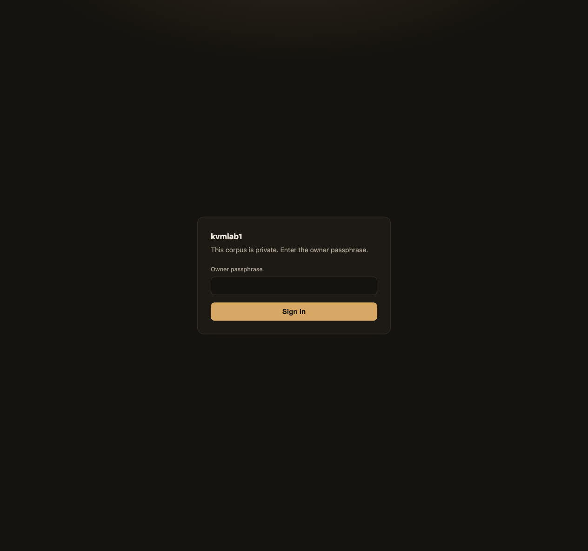
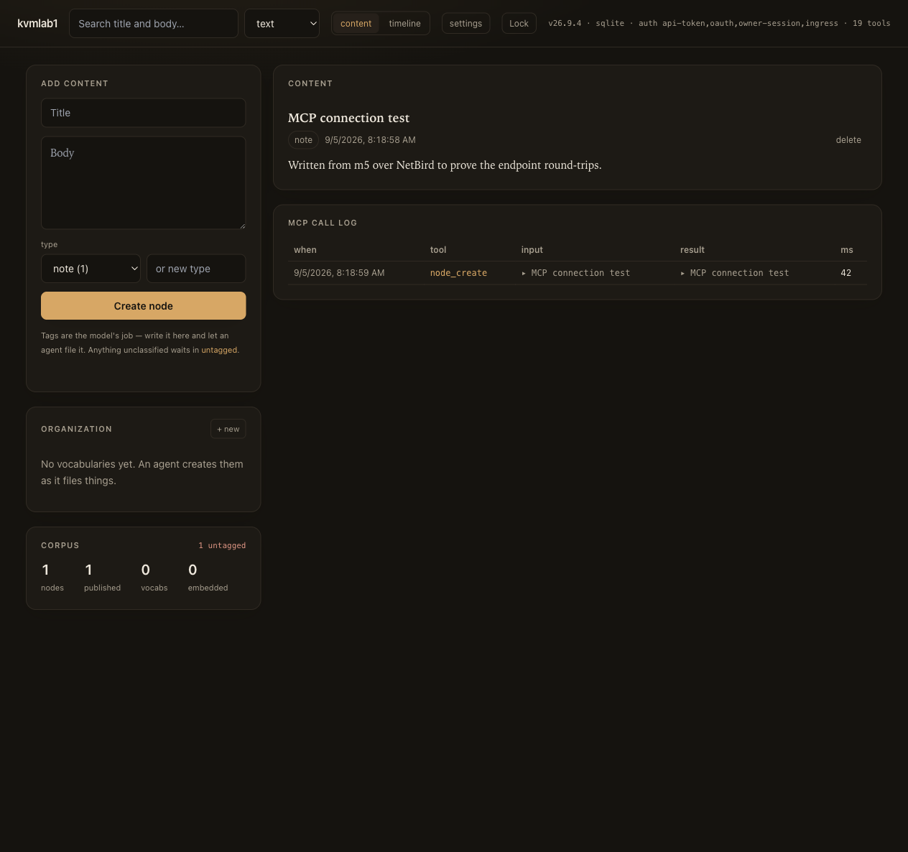
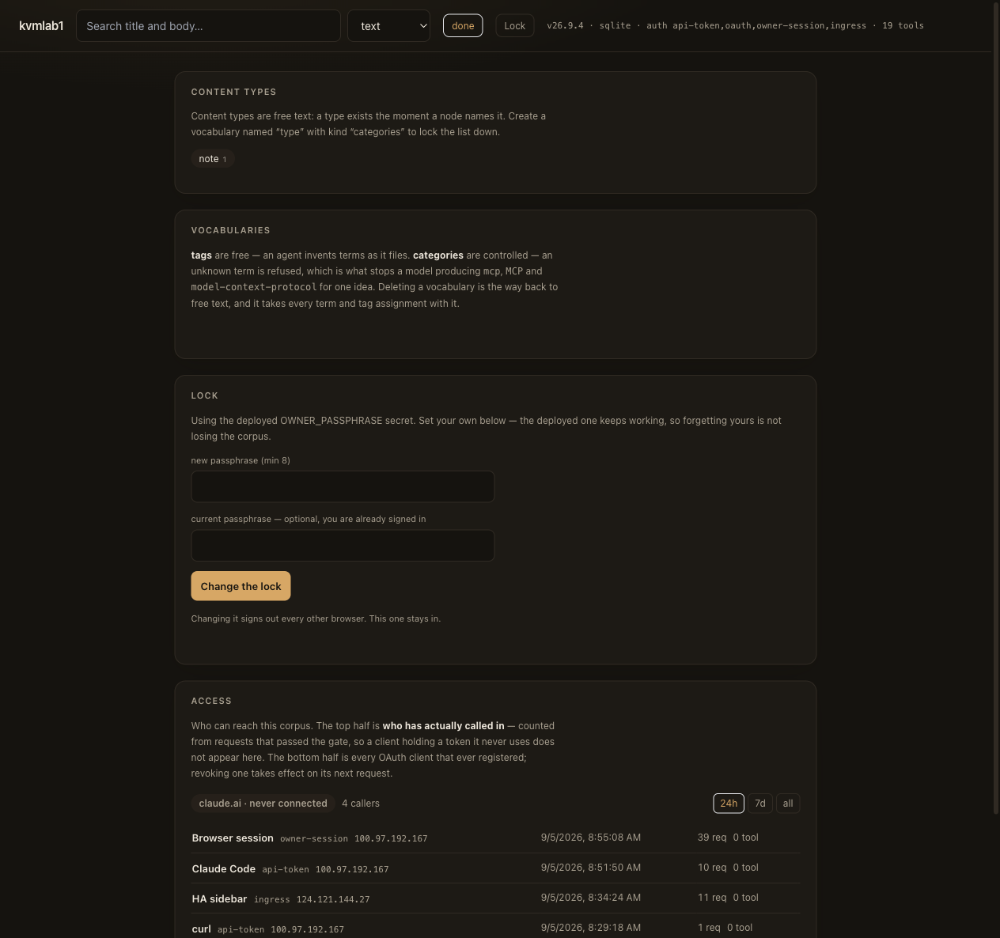
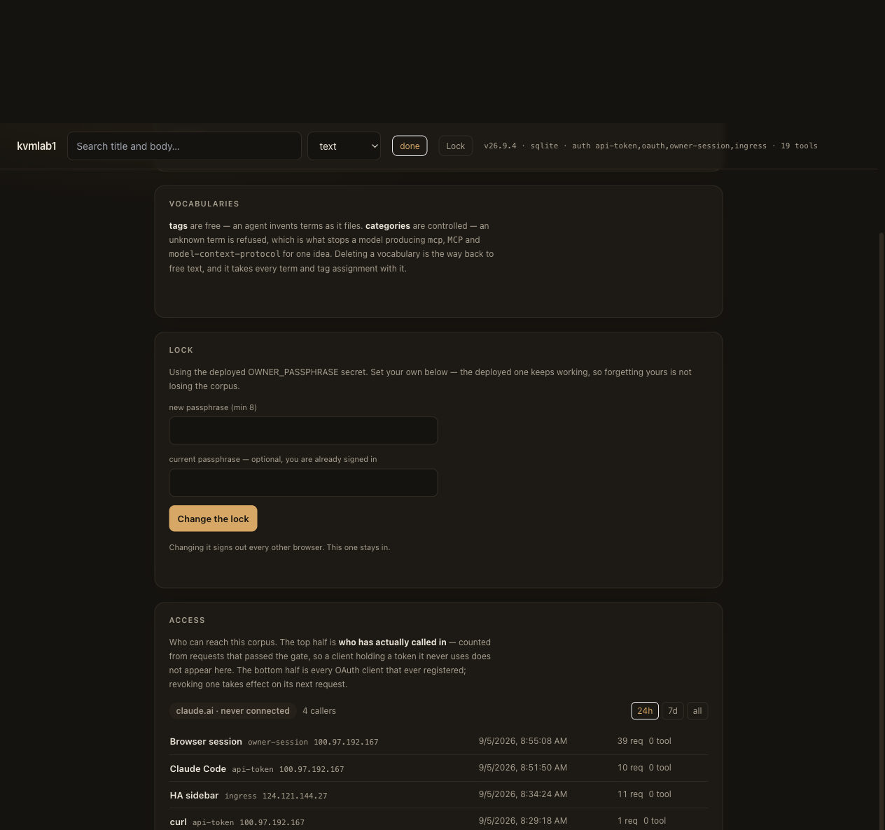

# Running trace-node on your own machine

*Inherited from digger-node at the fork (`ff5b5cd`). The add-on slug, hostnames
and screenshots below are digger's until step 1 renames them and gate 2
regenerates the screenshots.*

The same application that runs at `digger-node.laris.workers.dev` on Cloudflare
Workers + D1, storing to a SQLite file on a box you own instead.

This guide is the Home Assistant OS path, because that is where it is deployed
and verified. Every screenshot below is the running add-on on `kvmlab1`, not a
mockup.

- [1. Install](#1-install) · [2. Configure](#2-configure) · [3. Sign in](#3-sign-in)
- [4. The corpus](#4-the-corpus) · [5. Settings](#5-settings) · [6. Access](#6-access)
- [7. Connect MCP](#7-connect-mcp) · [8. Publishing it](#8-publishing-it)

---

## 1. Install

digger-node ships as an add-on in the **Oracle HAOS Factory** store.

In Home Assistant: **Settings → Add-ons → Add-on Store → ⋮ → Repositories**, add

```
https://github.com/Soul-Brews-Studio/oracle-haos-factory
```

**Digger Node** then appears with an Install button. Images are published for
`amd64` and `aarch64`, so installing is a pull rather than a build on your box.

<details>
<summary>Installing it as a <b>local</b> add-on instead</summary>

Copy `07-digger_node/` to `/addons/digger_node/` on the HA machine, remove the
`image:` line from `config.yaml` so Supervisor builds the Dockerfile beside it,
then:

```bash
ha store reload            # NOT `ha addons reload` — that prints CLI version info and does nothing
ha store addons install local_digger_node
ha addons start local_digger_node
```

`ha store reload` is the step people miss: without it the add-on is invisible in
the store and there is no error anywhere to say why.

</details>

## 2. Configure

| Option | What it does |
|---|---|
| `instance_name` | Shown in the page header. Useful when you run more than one. |
| `owner_passphrase` | Unlocks the web UI and authorizes OAuth clients. **Empty ships open.** |
| `api_token` | A static bearer for API and MCP clients that read a config file. |
| `rate_limit` | `on` throttles the passphrase endpoints — five attempts, then exponential backoff. |
| `auto_login` | Opening the sidebar panel signs you in, because Home Assistant already asked who you are. |
| `public_url` | Only when published through a tunnel — see [§8](#8-publishing-it). |

> **Set a passphrase before you expose the port.** With both `owner_passphrase`
> and `api_token` empty the node is open on port 8108 and the add-on log says so
> on every start. The sidebar is still protected — ingress puts Home Assistant's
> own login in front — but the mapped port is not, and the mapped port exists
> precisely so MCP clients can reach it.

Then turn on **Show in sidebar** so the panel appears next to your dashboards.

## 3. Sign in



The passphrase alone is the credential; there is no username. If `auto_login` is
on and you open the panel from the Home Assistant sidebar, you skip this screen
entirely — HA has already authenticated you.

That shortcut is deliberately narrow. It requires **both** the ingress header
*and* a source address on the internal `172.30.32.0/23` bridge, so reaching port
8108 from the LAN or a VPN never gets it. A forged header from outside is
refused.

## 4. The corpus



Write on the left, read on the right. The header strip reports state rather than
configuration — driver, active auth modes, tool count — so "what is this node
actually doing" never needs to be inferred.

Tags are **read controls**, not form fields: every tag is a click-to-filter
button, because tags are the model's output, not something a human should be
typing into a box.

## 5. Settings



Three panels, then Access below them:

- **Content types** — free text by default; a type exists the moment a node
  names it. Create a vocabulary named `type` with kind `categories` to lock the
  list down.
- **Vocabularies** — `tags` are free, `categories` are controlled. The
  controlled kind is what stops a model producing `mcp`, `MCP` and
  `model-context-protocol` for one idea.
- **Lock** — change the passphrase. The deployed secret keeps working as a
  recovery path, so forgetting the one you set here is not losing the corpus.
  Minimum 8 characters *in this form*; the add-on option has no floor, because
  it is the recovery path.

## 6. Access


**Who can reach this corpus**, in two halves.

The top half is **who has actually called in** — folded from requests that
passed the gate. A client holding a token it never uses does not appear here,
which is the whole point: `oauth_clients` knows who registered, and registering
is not calling.

Each row is one caller, not one request:

| Row | Identified by |
|---|---|
| `Browser session` | you, in a browser tab |
| `Claude Code` / `Codex` / `curl` | the user-agent family — one static token is shared by every script, so the UA is the only identity there is |
| `HA sidebar` | Home Assistant, proxying for whoever is signed into it |
| `claude.ai · <name>` | an OAuth client that **registered a claude.ai callback** |

That last one matters more than it looks. Claude Code can also arrive over
OAuth, so labelling every OAuth client "claude.ai" would answer the question
wrongly in exactly the case you care about. The badge has three states —
**connected** (called within the hour), **has a token, quiet**, and **never
connected** — because "holds a token" and "is calling" are different facts, and
an idle token is the one worth seeing.



The bottom half is every OAuth client that ever registered, with its live token
count and when it last got one. **Revoke** takes effect on that client's next
request; it can only come back through consent again.

Nothing in this table is a credential — the bearer that proved a caller is
discarded at the gate and only the *method* survives.

## 7. Connect MCP

19 tools over `/mcp`. Two clients, two shapes:

```bash
# Claude Code — header goes in the config
claude mcp add --scope user --transport http digger-kvmlab1 \
  http://<your-host>:8108/mcp \
  --header "Authorization: Bearer $(pass kvmlab1/digger-node-api-token)"

# Codex — takes the NAME of an env var, so the token never lands in config.toml
codex mcp add digger-kvmlab1 \
  --url http://<your-host>:8108/mcp \
  --bearer-token-env-var DIGGER_KVMLAB1_TOKEN
```

Codex needs that variable exported in your shell or it has nothing to read:

```bash
export DIGGER_KVMLAB1_TOKEN="$(pass kvmlab1/digger-node-api-token)"
```

Verify without a client:

```bash
curl -s -X POST http://<your-host>:8108/mcp \
  -H "authorization: Bearer $TOKEN" -H 'content-type: application/json' \
  -d '{"jsonrpc":"2.0","id":1,"method":"tools/list"}' | jq '.result.tools | length'
# 19
```

> **Ingress cannot carry MCP.** An MCP client cannot authenticate to, or address,
> an ingress URL — which is why port 8108 is published at all. That port is
> guarded by `owner_passphrase` / `api_token`, **not** by Home Assistant's
> session.

## 8. Publishing it

The sidebar panel is reachable wherever Home Assistant is, at `/local_digger_node`
— including through a Cloudflare tunnel, with HA's own login in front of it.

For **claude.ai** to reach `/mcp`, that is not enough: claude.ai needs a public
HTTPS origin for the MCP endpoint itself. Two steps:

1. **Route a hostname to the add-on's port.** In Cloudflare Zero Trust →
   Networks → Tunnels → your tunnel → Public Hostnames → Add:

   | field | value |
   |---|---|
   | Subdomain | `digger-node` |
   | Domain | your zone |
   | Service | `http://local-digger-node:8108` |

   The hyphens in that service host are load-bearing: Home Assistant converts
   add-on slug underscores to hyphens for the container hostname, and the
   underscore form does not resolve.

2. **Set `public_url`** to that exact origin in the add-on's Configuration tab.

Step 2 is not cosmetic. OAuth's `issuer` must equal the origin the client
actually reached, **byte for byte**. Behind a proxy that rewrites `Host`, the
app otherwise advertises its internal origin and the mismatch fails **silently
and only for OAuth clients** — the browser session and the bearer token keep
working, so it presents as "claude.ai is broken" rather than as a configuration
error.

Then, in claude.ai: **Settings → Connectors → Add custom connector**, and give it

```
https://digger-node.<your-zone>/mcp
```

It registers itself (RFC 7591 dynamic client registration), sends you to a
consent screen, and you approve with the owner passphrase. After that it shows
in the Access panel as `claude.ai · <name>`.

## Where the data lives

`/data/digger.db`. That path is chosen, not incidental: `/data` is the only
add-on directory Supervisor keeps across an update and the only one included in
a Home Assistant backup.

The corollary is worth saying plainly: **your corpus rides inside your Home
Assistant backups**, along with whatever passphrase is stored in it.

Migrations are recorded in a `schema_migrations` ledger and each runs at most
once, so restarting the add-on is a safe recovery step rather than a
data-loss event.

## Search is text-only here

On Cloudflare the app embeds with Workers AI. That is a Cloudflare binding with
no local equivalent, so a self-hosted node runs **trigram full-text search only**
and `/health` reports `"embedder": null` rather than implying a vector index that
is not there.
